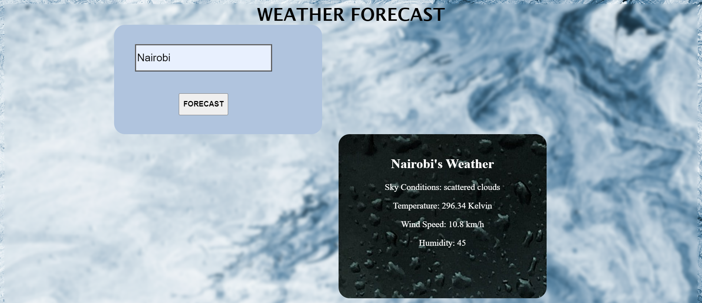

# Weather-app

## About
This is a weather app that allows a user to enter a location, and fetch data from a weather API to show the current weather.

## Features
A user can; 

<ul>
<li>Get information on the current weather in various locations.</li> 
<li>Search for over 200 locations all over the world.</li>
</ul>

## Live Link 
https://melynatieno.github.io/weather-app/

## The app was built using;
<ul>
<li>HTML </li>  
<li>CSS </li>  
<li>Javascript </li>
</ul>

## Geting Started

Clone this repository on your local machine, using the command line interface: 

` git clone git@github.com:MelynAtieno/weather-app.git`

Navigate to the project directory: 

`cd weather-app`

To open the project on Visual studio, run:

`code .`

In the terminal, type  `explorer.exe index.html`, to open the index.html file in the browser

## Author
[Melyn Atieno](https://github.com/MelynAtieno)

## MIT License
Copyright © 2022 weather-app

Permission is hereby granted, free of charge, to any person obtaining a copy of this software and associated documentation files (the “Software”), to deal in the Software without restriction, including without limitation the rights to use, copy, modify, merge, publish, distribute, sublicense, and/or sell copies of the Software, and to permit persons to whom the Software is furnished to do so, subject to the following conditions:

The above copyright notice and this permission notice shall be included in all copies or substantial portions of the Software.

THE SOFTWARE IS PROVIDED “AS IS”, WITHOUT WARRANTY OF ANY KIND, EXPRESS OR IMPLIED, INCLUDING BUT NOT LIMITED TO THE WARRANTIES OF MERCHANTABILITY, FITNESS FOR A PARTICULAR PURPOSE AND NONINFRINGEMENT. IN NO EVENT SHALL THE AUTHORS OR COPYRIGHT HOLDERS BE LIABLE FOR ANY CLAIM, DAMAGES OR OTHER LIABILITY, WHETHER IN AN ACTION OF CONTRACT, TORT OR OTHERWISE, ARISING FROM, OUT OF OR IN CONNECTION WITH THE SOFTWARE OR THE USE OR OTHER DEALINGS IN THE SOFTWARE.
